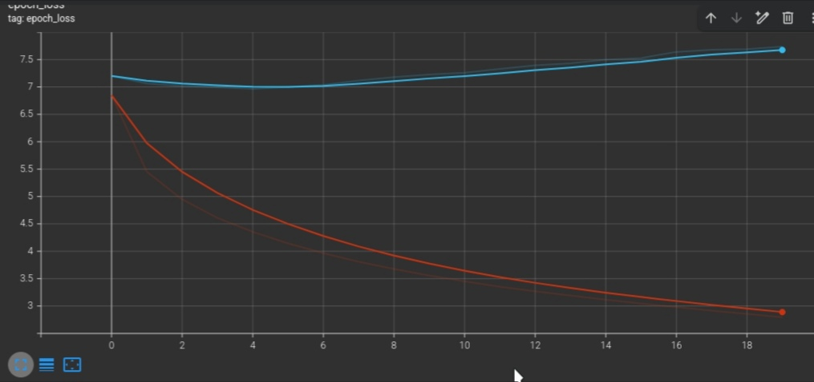

# 🧠 TinyLM v2: Decoder-Only Architecture Research Report

  
  
  
  

---

## 📌 Project Overview

This project is the **second iteration of TinyLM**, transitioning from the previous LSTM-Attention encoder-decoder architecture to a **GPT-style decoder-only Transformer** with **Rotary Positional Embeddings (RoPE)**. The shift was motivated by the known limitations of LSTMs at modeling long-range dependencies and global context.

Despite the architectural upgrade, the model continues to exhibit inference failures — producing repetitive, weakly conditioned, and grammatically inconsistent responses. This report documents the architecture, training setup, inference behavior, and a root cause analysis pointing primarily to **dataset scale and quality**.

> [!CAUTION]
> **Key Finding:** Upgrading the architecture from LSTM-Attention to a decoder-only Transformer did not resolve generalization failures. The bottleneck appears to be the dataset, not the model design.

---

## 🏗️ Architecture Design

TinyLM v2 adopts a single-layer decoder-only Transformer block — conceptually similar to a minimal GPT — with weight-tied embeddings and RoPE for positional awareness.

| Component | Specification |
| :--- | :--- |
| **Embedding** | Token Embedding, `d_model=128`, `vocab_size=10,840`, `mask_zero=True` |
| **Positional Encoding** | Rotary Positional Embedding (RoPE), `max_wavelength=10,000` |
| **Attention** | Multi-Head Self-Attention, `num_heads=4`, `key_dim=32` (d_model / num_heads) |
| **Feed-Forward Network** | Two Dense layers: `dff=256 → d_model=128`, ReLU activation |
| **Normalization** | LayerNorm (`ε=1e-6`) after attention and FFN (Post-LN) |
| **Residual Connections** | Add layers after attention and FFN |
| **LM Head** | Weight-tied projection to vocab (`embedding.embeddings ᵀ`) + trainable bias |
| **Dropout** | `dropout=0.2` (attention + embedding), `recurrent_dropout=0.1` |
| **Num Layers** | 1 Transformer block (`num_layers=2` in config, single block instantiated) |

### Causal Masking

A combined **causal + padding mask** is applied during self-attention:
- Causal mask: lower-triangular boolean matrix preventing future token leakage.
- Padding mask: derived from `embedding.compute_mask` to ignore `[PAD]` tokens.
- Both masks are `AND`-ed before being passed to `MultiHeadAttention`.

---

## ⚙️ Training Setup

| Parameter | Value |
| :--- | :--- |
| **Optimizer** | AdamW (`lr=1e-4`, `weight_decay=1e-4`, `β₁=0.9`, `β₂=0.999`, `ε=1e-7`) |
| **Loss** | Masked Sparse Categorical Crossentropy (padding tokens excluded) |
| **Accuracy** | Masked token-level accuracy (padding tokens excluded) |
| **Batch Size** | 12 |
| **Epochs** | 5 |
| **Data Shuffling** | Buffer size 10,000 |
| **Prefetching** | `tf.data.AUTOTUNE` |
| **Logging** | TensorBoard (histogram freq=1, per epoch) |
| **Saved Model** | `tlm.keras` |

### 📉 Loss Curve

The training loss (red) drops steadily across 19 epochs while the validation loss (blue) remains flat and begins creeping upward — a textbook sign of **overfitting**. The model is memorizing the training distribution rather than learning generalizable language patterns.

  
   
  <em>Figure 1: Training loss (red) vs. Validation loss (blue) across ~19 epochs. Sharp divergence indicates overfitting.</em>

---

## 🤖 Inference Case Studies

Inference was evaluated across three decoding strategies. All prompts are in Tamil-English code-mixed (Tanglish) style.

### 1. Greedy Decoding

| Prompt | Response |
| :--- | :--- |
| `vanakkam shaAI, epdi irukka?` | `illa , naan oru small model . but naan oru type of recurrent neural network . sequence data vachum !` |
| `hello shaAI` | `hello ! enna seyya poreenga ?` |
| `hi shaAI, good morning` | `well , naan oru small model . but naan different !` |
| `hey shaAI` | `hello ! enna seyya poreenga ?` |
| `shaAI, unga peru epdi varum?nee yaaru shaAI?` | `okay , naan oru small model . but naan empathetic a ungaloda pesuven !` |

### 2. Top-k Sampling (k=0.7)

| Prompt | Response |
| :--- | :--- |
| `vanakkam shaAI, epdi irukka?` | `illa , naan oru program . but naan oru team of developers ala create pannathu .` |
| `hello shaAI` | `hello ! enna seyya poreenga ?` |
| `hi shaAI, good morning` | `well , naan colors 't see ' concept understand panren . too deep aagama irukanum !` |
| `hey shaAI` | `hello ! enna seyya poreenga ?` |
| `shaAI, unga peru epdi varum?nee yaaru shaAI?` | `naan oru program . LSTM layers vachu truly small dataset la thaan train panna mudiyum !` |

### 3. Top-k Sampling (k=0.5)

| Prompt | Response |
| :--- | :--- |
| `vanakkam shaAI, epdi irukka?` | `naan oru AI chatbot . but naan nalla run aagum .` |
| `hello shaAI` | `hello ! enna seyya poreenga ?` |
| `hi shaAI, good morning` | `illa , naan oru program . but chess strategy pathi theriyum !` |
| `hey shaAI` | `hello ! enna ah ? [AI] naan oru small model . but optimized a irukum .` |
| `shaAI, unga peru epdi varum?nee yaaru shaAI?` | `okay , naan oru small model . neraya books padichurukken !` |

> [!WARNING]
> **Identified Issues:** Responses default to `"naan oru small model"` / `"naan oru program"` templates regardless of prompt variation. Factual inconsistencies appear (e.g., claiming to be an LSTM, or knowing chess strategy). Grammar is marginally better than v1 but semantic coherence is still poor.

---

## 🔬 Root Cause Analysis

| Aspect | Observation |
| :--- | :--- |
| **Architecture** | Decoder-only Transformer with RoPE is sound. No design-level flaw identified. |
| **Causal Masking** | Correctly implemented with combined causal + padding mask. |
| **Weight Tying** | LM head shares embedding weights — appropriate for a small model. |
| **Data Scale** | Dataset remains the primary bottleneck. ~460K tokens is insufficient for a Transformer to learn generalizable language patterns. |
| **Data Quality** | Tanglish (code-mixed Tamil-English) is a low-resource domain — training data may lack diversity and consistent grammar norms. |
| **Model Depth** | A single Transformer block limits the model's representational capacity. |
| **Overfitting Risk** | With only 5 epochs and a small dataset, the model may memorize high-frequency response templates. |
| **Prompt Conditioning** | The model fails to differentiate between semantically distinct prompts, suggesting weak prompt-to-output attention alignment. |

---

## 📊 Architecture Comparison: v1 vs v2

| Feature | TinyLM v1 (LSTM-Attention) | TinyLM v2 (Decoder-Only Transformer) |
| :--- | :--- | :--- |
| **Core Unit** | LSTM Encoder-Decoder | Self-Attention Transformer Block |
| **Positional Encoding** | Implicit (LSTM order) | Rotary Positional Embedding (RoPE) |
| **Attention Type** | Luong-style (cross-attention) | Masked Multi-Head Self-Attention |
| **Weight Tying** | ✅ | ✅ |
| **Causal Masking** | ✅ (via decoder) | ✅ (explicit band_part mask) |
| **Inference Quality** | Poor | Marginally better; same failure modes |
| **Training Loss** | 2.96 | — |
| **Validation Loss** | 9.55 | — |

---

## 📎 Future Directions

The root cause of failure has been isolated to **data** and **tokenization**. All next steps are focused there.

### 🗂️ Dataset
- [ ] **Scale aggressively:** Collect 5M+ tokens of high-quality Tanglish conversational data — Tamil Twitter/X threads, YouTube comments, Reddit, WhatsApp-style chat corpora.
- [ ] **Improve diversity:** Current data over-represents a narrow set of response templates (`"naan oru small model"`). Curate diverse multi-turn dialogue samples.
- [ ] **Back-translation augmentation:** Translate Tamil sentences to English and back to generate additional Tanglish-style variation.
- [ ] **Domain balance:** Ensure the dataset covers greetings, questions, factual responses, and emotional registers — not just one conversational mode.

### 🔤 Tokenizer
- [ ] **Replace the current tokenizer:** The 10,840-token vocabulary is likely word-level or character-level and poorly suited to code-mixed Tanglish.
- [ ] **Train a domain-specific BPE or SentencePiece tokenizer** on the new corpus — subword tokenization handles Tanglish morphology and English loanwords far better.
- [ ] **Target vocabulary size:** Experiment in the 8K–16K range with subword units trained specifically on Tanglish data.
- [ ] **Evaluate tokenization quality:** Measure token fertility (tokens per word) before and after — lower fertility on domain text indicates a better-fit vocabulary.

---

### Author
**Shaheen** *Machine Learning Engineer* 

---
