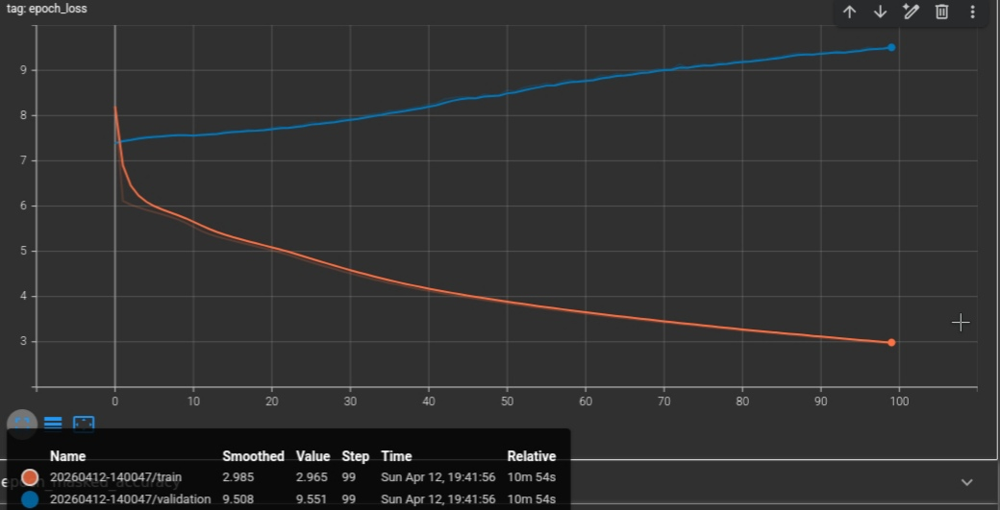

# 🧠 TinyLM Failure Analysis: A Research Report

  
  
  

---

## 📌 Project Overview

This project implements **TinyLM**, a small-scale language model utilizing an **LSTM-based encoder-decoder architecture** with **Luong-style attention**. Despite standard training procedures on ~460K tokens, the model serves as a "successful failure" case study—achieving low training loss but failing to generalize during inference.

> [!CAUTION]
> **Key Finding:** Low training loss and high training accuracy (50%) do not guarantee a functional language model. This project highlights the gap between metric optimization and semantic understanding.

---

## 🏗️ Architecture Design

The model follows a classic sequence-to-sequence flow with shared weights for efficiency.

| Component | Specification |
| :--- | :--- |
| **Input Pipeline** | Embedding (256-dim) → Encoder LSTM |
| **Attention** | Luong-style Dot-Product (`tf.keras.layers.Attention`) |
| **Output** | Dense Layer with **Weight Tying** to Embedding |
| **Vocab Size** | 10,840 tokens |

---

## 📊 Training Performance

The divergence between training and validation metrics indicates a classic case of **severe overfitting**.

### Metrics at a Glance
| Metric | Training | Validation |
| :--- | :--- | :--- |
| **Loss** | `2.96` | `9.55` |
| **Accuracy** | `50.1%` | `11.2%` |

### 📉 Loss Behavior
The training loss decreases steadily while validation loss increases, showing that the model is **memorizing noise** rather than learning linguistic patterns.

  
   
  <em>Figure 1: Sharp divergence in validation loss vs. training epochs.</em>

---

## 🤖 Inference Case Studies

Inference results reveal that the model relies on "safe" repetitive phrases and fails to maintain grammatical coherence.

### 1. Greedy Decoding
* **Prompt:** `hello shaAI`
* **Response:** `actually , enna , naan oru seyya poreenga .`

### 2. Top-k Sampling
* **Prompt:** `vanakkam shaAI, epdi irukka?`
* **Response:** `naan vachirundha nalla irukken . but usually irukkinga la irukku !`

> [!WARNING]
> **Identified Issues:** Broken grammar, weak prompt conditioning, and over-reliance on common tokens like "actually" or "naan oru".

---

## 🔬 Root Cause Analysis

| Aspect | Observation |
| :--- | :--- |
| **Semantic Space** | Weak clustering; unrelated tokens show high overlap in embedding space. |
| **Context** | The model captures local token transitions but fails at global context understanding. |
| **Data Scale** | 460K tokens proved insufficient for the complexity of the LSTM-Attention architecture. |

---

## 📎 Future Directions

- [ ] **Shift to Decoder-Only:** Transition to a GPT-style (Transformer) architecture.
- [ ] **Attention Mapping:** Visualize weight distribution to identify "blind spots."
- [ ] **Data Augmentation:** Scale the dataset significantly to improve generalization.
- [ ] **Similarity Analysis:** Use Cosine Distance to evaluate embedding quality post-training.

---

### Author
**Shaheen** *Machine Learning Engineer* 

---
